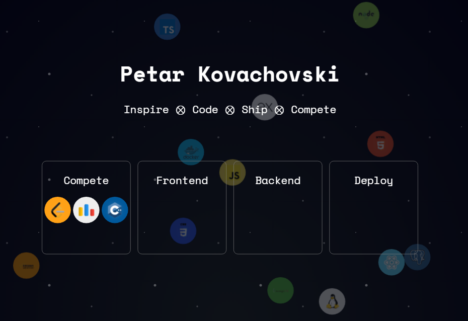

# My Porfolio Website

## 🪐 Welcome to my space

An interactive, animated canvas of tech skills orbiting the page like stars in space. Built to be aesthetic, performant, and snappy.

---

## What is this?

A visually rich front-end project where skill icons float around like zero-gravity bubbles. Hover over grouped stations to magnetically pull specific skills to your cursor. Click a skill bubble and it zips off in a new direction.

---

## 🛠 Technologies

- HTML5 & CSS3 (custom animation & media queries)
- Vanilla JavaScript (no libraries)
- Responsive & mobile-friendly
- Optimized for GPU compositing (using `transform: translate3d`)
- Custom logic for image caching, frame throttling, and interaction
- Optimizes for FPS perfomance on ALL browsers and slow networks

---

## Features

- Smooth 60–120FPS skill box animations
- Hover to attract related skills to predefined "stations"
- Transition on entry with scaling and opacity
- Subtle animated star background (CSS only)
- Safari-compatible with transition edge-case fixes

---

## Clone it? Fully customizeable

Want to change the skills?

1. Add your `.svg` to `/skills/`
2. Update `skills[]` in `box.js`
3. Assign a color in `customBackgrounds`

---

## Author

Built with love and frustration by [Petar Kovachovski](https://petski.dev)

## License

MIT – use it, break it, customize it.
